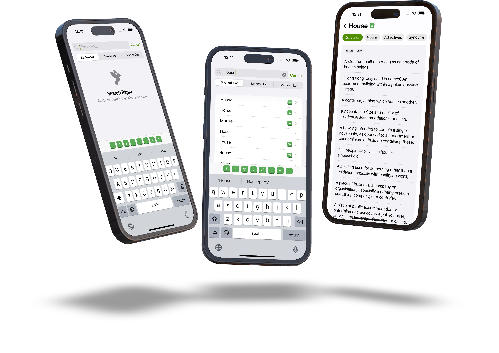

  
  <h1 align="center">Pápia</h1>

[Pápia](https://github.com/StefKors/Pa-pia) is a fast word search app for players, puzzlers, and word nerds.

Search by spelling, meaning, or sound, then narrow results with built-in filters for Wordle, Scrabble, CrossPlay, and Bongo. Use wildcard patterns to explore letter combinations, unscramble anagrams, and quickly check whether a word fits the game you are playing.

Open any result to view definitions, synonyms, and related words so you can move from a rough idea to the exact word you need.

#### Supported Platforms

## Features

- Search by `spelled like`, `means like`, or `sounds like`
- Use wildcard patterns and anagram-style queries
- Filter results by Wordle, Scrabble, CrossPlay, and Bongo word lists
- Switch between bundled regional tournament dictionaries
- Explore definitions, synonyms, antonyms, homophones, and related words
- Keep recent searches available locally on device

## Search Examples

- `appl?` to find close spelling matches
- `//soulbeat` to unscramble an anagram
- `happy` with `Means like` to explore semantically related words

## Data and Privacy

- Pápia uses the Datamuse API for online word discovery, definitions, and related-word search.
- Recent searches are stored locally on device to power search history.
- Bundled dictionaries are stored locally and used to label and filter results.

## Attribution

Pápia uses the Datamuse API for online word search and related-word results.

-------

Built by [Stef Kors](https://stefkors.com).

-------

