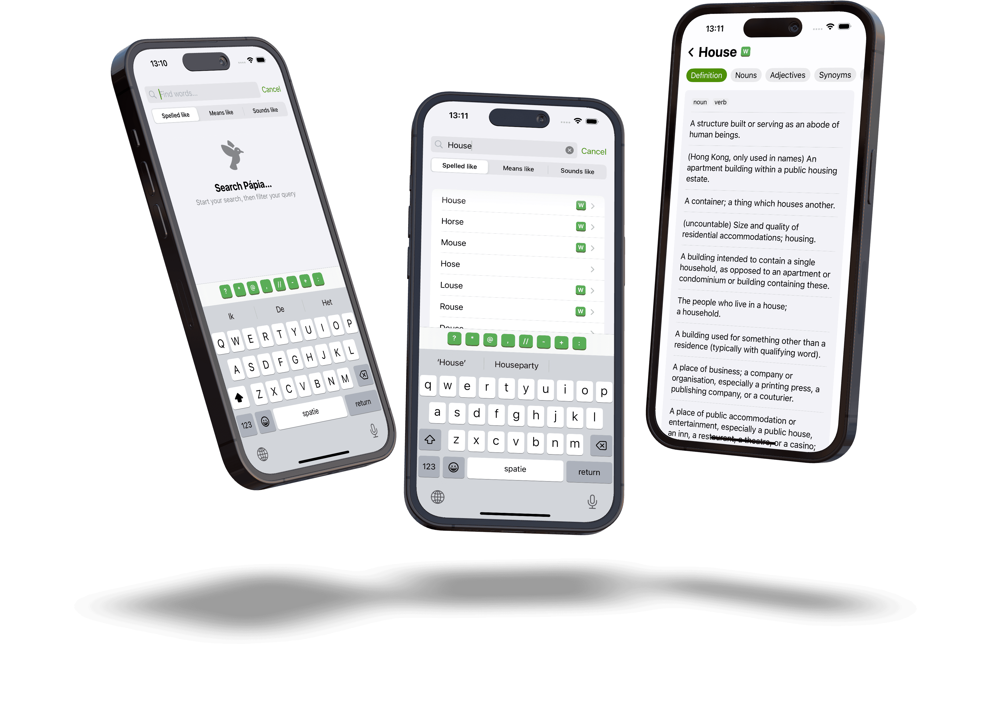

  
  <h1 align="center">Pápia</h1>

[Pápia](https://github.com/StefKors/Pa-pia) is a word search app, named after confusingly named greek ducks/geese.

#### Supported Platforms

<picture>
  <source media="(prefers-color-scheme: dark)" srcset="Images/macos.svg">
  <source media="(prefers-color-scheme: light)" srcset="Images/macos-active.svg">
  
</picture>

<picture>
  <source media="(prefers-color-scheme: dark)" srcset="Images/ios-active.svg">
  <source media="(prefers-color-scheme: light)" srcset="Images/ios.svg">
  
</picture>

<picture>
  <source media="(prefers-color-scheme: dark)" srcset="Images/ipados-active.svg">
  <source media="(prefers-color-scheme: light)" srcset="Images/ipados.svg">
  
</picture>

<picture>
  <source media="(prefers-color-scheme: dark)" srcset="Images/tvos-active.svg">
  <source media="(prefers-color-scheme: light)" srcset="Images/tvos.svg">
  
</picture>

<picture>
  <source media="(prefers-color-scheme: dark)" srcset="Images/watchos-active.svg">
  <source media="(prefers-color-scheme: light)" srcset="Images/watchos.svg">
  
</picture>

-------

-------

Built by [Stef Kors](https://stefkors.com)

-------

